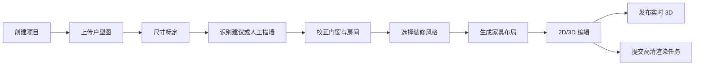
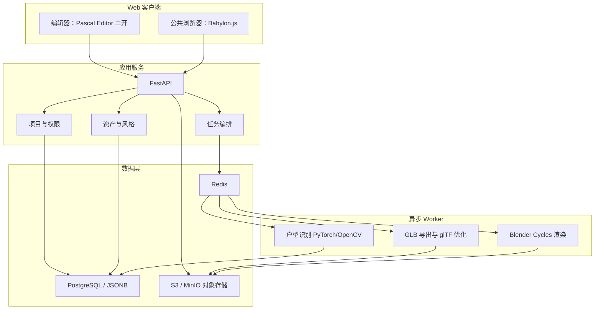

# 3D 户型生成平台项目统筹计划

版本：v0.1

日期：2026-07-15

状态：立项评审稿，尚未进入正式编码

## 1. 项目结论

项目采用“结构化场景驱动”的路线：户型图只是输入，场景 JSON 才是权威数据；实时 3D、GLB、高清效果图都是它的派生结果。

首版不追求任意户型全自动识别，而是先完成：

1. 上传单层住宅户型图并标定尺寸。
2. 自动建议或人工绘制墙体、门窗和房间。
3. 生成可编辑的结构化 3D 户型。
4. 提供 3 套装修风格和规则化家具布置。
5. 手机、平板、电脑通过浏览器实时查看。
6. 服务端输出高清效果图。

第一周先实施技术可行性验证。验证不通过时允许更换编辑器底座，但不改变场景 JSON 和分层架构。

## 2. 当前规划假设

以下假设用于推进，不代表永久产品限制：

- 产品按商业闭源系统规划，优先采用 MIT、Apache-2.0、BSD、CC0 组件和资产。
- 首版面向普通住宅设计展示，不作为施工图或工程算量工具。
- 输入以 JPG、PNG、单页 PDF 为主；DWG、DXF、复式和多层住宅暂缓。
- 首版支持直墙和斜墙，不支持弧形墙、错层、复杂楼梯和异形屋顶。
- 单层建筑面积上限暂定 300 平方米。
- 首批装修风格：现代简约、原木奶油、新中式。
- 对外形态先做响应式 Web，不开发原生 iOS/Android App。
- “实时漫游”和“照片级效果图”使用两条渲染链路。

## 3. MVP 范围

### 3.1 必须交付

- 项目创建、保存、复制、版本恢复。
- 上传户型图，旋转、裁剪、透明度调整。
- 选择一条已知尺寸进行比例标定。
- 墙体绘制、吸附、移动、拆分、连接、修改墙厚和层高。
- 门窗添加、移动、调整尺寸和离地高度。
- 自动形成房间闭合区域，并允许设置房间类型。
- 2D 顶视图与 3D 视图切换。
- 结构化场景 JSON 保存和版本升级机制。
- 家具资产库、材质库和风格包。
- 一键应用风格，生成可修改的家具布局候选。
- GLB 导出、压缩和移动端浏览。
- 生成 1920×1080 效果图，至少支持 4 个预设视角。
- 分享链接和只读查看权限。
- 关键操作日志和失败任务重试。

### 3.2 明确不做

- 完全无人工确认的任意户型自动建模。
- 施工图、结构设计、暖通水电、工程算量和报价。
- 多人实时协同编辑。
- 原生移动 App。
- 第一版即接入商品购买和供应链。
- 第一版使用端到端生成式 AI 直接生成完整 3D 场景。
- 复杂 BIM、IFC、DWG/DXF 双向编辑。

## 4. 用户主流程



任何自动识别结果都必须进入校正页面，不能直接生成不可编辑模型。

## 5. 总体技术架构



## 6. 技术栈冻结建议

| 层级 | 首选技术 | 决策说明 |
|---|---|---|
| Monorepo | Bun 1.3 + Turborepo | 尽量沿用 Pascal Editor 上游，降低二开偏差 |
| 编辑器前端 | Next.js 16、React 19、TypeScript 6 | 跟随锁定的 Pascal Editor commit，不追踪主分支滚动升级 |
| 编辑器 3D | React Three Fiber、Three.js 0.184、Zustand、Zod | 复用 Pascal 的场景节点、墙体和洞口能力 |
| 公共浏览器 | Babylon.js 9.x | WebGL2 作为兼容基线，WebGPU 渐进增强 |
| 业务与任务 API | Python 3.12、FastAPI、Pydantic | 与 AI、Blender Python 生态一致，减少服务语言数量 |
| ORM/迁移 | SQLAlchemy 2、Alembic | 管理项目、权限、资产、版本和任务元数据 |
| 数据库 | PostgreSQL 18，场景版本使用 JSONB | 结构化元数据关系化；场景 JSON 带 schemaVersion |
| 队列 | Redis + Celery | 识别、导出和渲染必须异步执行 |
| 对象存储 | S3 接口；本地 MinIO | 保存原始图片、模型、贴图、GLB和效果图 |
| 模型处理 | glTF-Transform 4.x | 清理、合并、实例化、Meshopt/KTX2和纹理降级 |
| 高清渲染 | Blender 4.5 LTS + Cycles + Python | 稳定版本优先，不跟随 Blender 每个大版本升级 |
| AI 推理 | PyTorch 2.x + OpenCV | 具体模型在合法数据验证后冻结 |
| 本地部署 | Docker Compose | MVP 不引入 Kubernetes |
| 生产入口 | Nginx + HTTPS + CDN | 静态模型和贴图经自有 CDN 发布 |
| 测试 | Vitest、Playwright、Pytest、场景黄金样例 | 同时验证几何、序列化、API和移动端流程 |
| 观测 | 结构化日志、Sentry、任务指标 | 首版至少能定位失败项目、失败阶段和输入文件 |

### 6.1 版本策略

- Fork Pascal Editor 后记录上游 commit，不直接依赖浮动 `main`。
- 依赖文件必须锁定，并输出 SBOM 与许可证清单。
- Blender、CUDA、PyTorch、GPU 驱动建立兼容矩阵。
- 每季度评估一次上游合并，不在开发中途随意升级 Three.js。

## 7. 权威场景数据模型

场景 JSON 是产品核心，不能把 GLB 或 `.blend` 文件当作权威数据。

### 7.1 坐标约定

- 单位：米。
- 右手坐标系。
- Y 轴向上，户型平面位于 XZ 平面。
- 角度在存储层统一使用弧度。
- 所有 ID 使用稳定 UUID/ULID，不使用数组索引作为引用。
- 浮点数保存完整精度，UI 展示时再格式化。

### 7.2 核心实体

```text
Scene
├── metadata
├── buildings[]
│   └── levels[]
│       ├── walls[]
│       ├── openings[]
│       ├── rooms[]
│       ├── slabs[]
│       ├── ceilings[]
│       ├── items[]
│       ├── lights[]
│       └── cameras[]
├── materials[]
├── assets[]
└── styleApplication
```

### 7.3 最小字段

- `schemaVersion`：数据结构版本。
- `revision`：项目乐观锁版本。
- `units`、`coordinateSystem`。
- 墙：起点、终点、厚度、高度、材质引用。
- 洞口：所属墙、沿墙偏移、宽、高、窗台高度、方向。
- 房间：闭合多边形、房间类型、面积、地面与墙面材质。
- 家具：资产 ID、位置、旋转、缩放、包围盒、摆放约束。
- 相机：位置、目标点、视场角和输出比例。
- 风格：风格包版本、随机种子、规则执行版本。

### 7.4 关键原则

- 每次保存产生不可变场景版本；项目指向当前版本。
- 所有派生文件记录来源场景版本和生成器版本。
- 旧场景通过显式 migration 升级，禁止静默修改结构。
- 保存前由共享 Zod/JSON Schema 校验。
- 场景 JSON 存 PostgreSQL；图片、GLB、贴图和渲染结果存对象存储。

## 8. 模块边界

### 8.1 编辑器

- 底图导入与尺寸标定。
- 墙、洞口、房间、家具和相机编辑。
- 2D/3D 视图和撤销重做。
- 调用场景校验器，不负责高清渲染。

### 8.2 场景核心

- 场景 Schema、迁移、几何约束和碰撞规则。
- 房间闭合、墙体连接、面积计算。
- 风格规则输入输出。
- 不依赖具体 UI。

### 8.3 户型识别

- 输入标准化图像。
- 输出墙节点、墙段、门窗、房间候选及置信度。
- 不直接输出最终 Mesh。
- 识别失败时不影响人工描绘流程。

### 8.4 风格与资产

- 风格包只描述材质、资产候选、色板、灯光、相机和规则。
- 家具资产带房间类型、风格、尺寸、靠墙/落地属性和许可证信息。
- 布局生成必须执行房间包含、门窗净空和 OBB 碰撞检查。

### 8.5 公共浏览器

- 只读加载优化 GLB。
- 支持鸟瞰、轨道、第一人称和房间热点。
- 根据设备能力选择纹理和 LOD。
- 不加载完整编辑器代码。

### 8.6 Blender 渲染适配器

- 直接读取权威场景 JSON 和原始资产。
- 生成 Cycles 材质、灯光、相机和渲染配置。
- 输出 JPG/WebP、缩略图和可选全景图。
- 与 Web 几何通过黄金样例校验尺寸和开口位置。

## 9. API 初步约定

| 接口 | 用途 |
|---|---|
| `POST /projects` | 创建项目 |
| `POST /projects/{id}/uploads` | 上传户型图 |
| `POST /projects/{id}/calibration` | 保存尺寸标定 |
| `GET /projects/{id}/scene` | 获取当前场景 |
| `POST /projects/{id}/scene-versions` | 保存不可变场景版本 |
| `POST /projects/{id}/jobs/recognize` | 创建识别任务 |
| `POST /projects/{id}/jobs/style` | 应用风格或生成布局候选 |
| `POST /projects/{id}/jobs/export` | 创建 GLB 导出任务 |
| `POST /projects/{id}/jobs/render` | 创建效果图任务 |
| `GET /jobs/{id}` | 查询进度与错误 |
| `POST /projects/{id}/publish` | 创建只读发布版本 |

任务进度首版使用 SSE；确有双向实时需求后再引入 WebSocket。

## 10. GLB 与移动端性能预算

以下是验收目标，不是引擎极限：

- 典型单层项目 GLB 目标不超过 40MB，硬上限 80MB。
- 移动端首屏必要资源控制在 15MB 左右。
- 移动端三角面目标 30万～80万；桌面端 100万～200万。
- 普通材质使用 1K 纹理，重点资产最高 2K；移动端不下发 4K。
- 重复家具使用 GPU instancing。
- 几何优先 Meshopt；纹理优先 KTX2/Basis，保留兼容降级版本。
- 参考中端手机上交互帧率中位数不低于 30 FPS。
- 20Mbps 网络下，典型项目进入可交互状态不超过 5 秒。
- 页面必须处理 WebGL/WebGPU 能力不足、显存不足和加载失败。

## 11. 高清渲染策略

- 实时浏览使用 PBR、烘焙光照和有限后处理。
- 高清效果图使用 Blender Cycles 路径追踪。
- 每个任务包含场景版本、Blender版本、渲染预设和随机种子。
- 任务通过 Redis/Celery 排队，GPU Worker 同时运行数量按显存控制。
- 第一版提供草稿、标准、高清三个质量档。
- 在目标 16～24GB 显存 GPU 上，单张 1080p 标准图 P90 目标不超过 5 分钟。

## 12. AI 识别路线

### 阶段 A：不依赖模型的可交付流程

- 图像去噪、二值化、倾斜校正。
- 线段和墙体候选提示。
- 强吸附、正交约束和房间闭合。
- 人工完成最终校正。

### 阶段 B：合法数据驱动的模型

- 建立自有或获得商业授权的户型数据集。
- 标注墙节点、墙段、门窗、房间多边形和房间类型。
- 训练输出拓扑图的模型，不只做目标框检测。
- 以“减少人工修改时间”为主要产品指标。

### AI 验收目标

- 标准单层户型，识别后人工修正中位时间不超过 5 分钟。
- 内部测试集墙体、门窗召回率目标不低于 90%。
- 低置信结果可视化提示，不得偷偷写入最终模型。
- AI 服务失败时人工流程仍然完整可用。

## 13. 阶段计划

### Phase 0：技术闸门，1 周

- 锁定 10 张代表性户型图、3 套风格参考和目标测试设备。
- Fork 并锁定 Pascal Editor commit，生成依赖及许可证清单。
- 导入一张户型底图，完成尺寸标定。
- 创建墙、门、窗、房间并保存场景 JSON。
- 输出 GLB，运行 glTF-Transform，手机和电脑查看。
- 用同一场景 JSON 在 Blender 输出一张效果图。
- 给出继续二开、局部重写或更换底座的结论。

### Phase 1：场景核心与编辑器，2～3 周

- 冻结场景 Schema v1 和迁移框架。
- 完成墙体、洞口、房间、楼板及尺寸编辑。
- 建立保存、版本、撤销恢复和黄金场景测试。

### Phase 2：资产与风格，2 周

- 建立资产清洗、单位、轴向、碰撞盒和缩略图规范。
- 上线 3 套风格包，每套至少覆盖客厅、卧室、餐厅。
- 完成规则摆放和碰撞检测。

### Phase 3：公共浏览与模型管线，2 周

- 完成 GLB 导出、Meshopt、KTX2、LOD 和性能报告。
- 完成响应式浏览器、分享链接和设备降级。

### Phase 4：API 与高清渲染，2 周

- 项目、场景版本、对象存储和异步任务 API。
- Blender 适配器、渲染预设、任务队列和失败重试。

### Phase 5：测试与试点，2 周

- 20～50 张真实户型回归测试。
- Android、iPhone、iPad 和桌面浏览器性能测试。
- 安全、备份、恢复、监控和许可证复核。
- 小范围用户试用和下一阶段决策。

基础 MVP 预计 11～12 周，前提是 4～6 人小组并行工作。自研识别模型作为并行工作流，数据准备和首版模型另预留 8～12 周。

## 14. 团队建议

| 角色 | 人数 | 核心职责 |
|---|---:|---|
| 技术负责人/架构 | 1 | 架构、场景模型、技术闸门、代码评审 |
| 3D Web 工程师 | 1 | Pascal/Three.js、几何、GLB、性能 |
| 前端工程师 | 1 | 编辑器 UI、项目流程、响应式交互 |
| Python/后端/AI 工程师 | 1 | FastAPI、任务、识别和 Blender 编排 |
| 3D 美术/室内设计 | 1 | 资产规范、材质、风格、灯光和验收 |
| 产品/测试 | 0.5～1 | 样例、验收、真机测试和试点反馈 |

如果只有 2～3 人，优先砍掉 AI 自动识别和全景图，保留人工校正、3 套风格和实时浏览。

## 15. 硬件与环境

- 开发工作站：12～16 核 CPU、64GB 内存、16GB 显存、2TB NVMe。
- MVP GPU Worker：Linux、64GB 内存、16～24GB NVIDIA 显存。
- Web/API：8 vCPU、16～32GB 内存，无需 GPU。
- 对象存储：首阶段预留 500GB～1TB，并启用生命周期策略。
- 开发环境使用 Docker Compose；GPU 容器单独维护兼容矩阵。

## 16. 验收标准

### 几何与数据

- 20 张标准户型全部可完成尺寸标定、墙体闭合和门窗编辑。
- 人工校正后关键尺寸误差不超过 1%。
- 场景保存、重开、撤销恢复后几何一致。
- 同一场景在 Web 与 Blender 中墙体、洞口和家具位置一致。
- 任意派生文件可追溯到场景版本、资产版本和生成器版本。

### 产品流程

- 无 AI 情况下，100 平方米标准户型人工建模中位时间不超过 15 分钟。
- 三种风格均能一键生成并继续手动编辑。
- 典型项目可生成分享链接和 4 张效果图。
- 识别、导出或渲染失败后可看到原因并重试。

### 移动端

- 参考设备不崩溃、不出现长时间黑屏。
- 典型项目达到前述 40MB、5秒、30FPS目标。
- 触摸旋转、缩放、漫游和热点交互可用。
- 低性能设备可以关闭阴影、反射和后处理。

## 17. 主要风险

| 风险 | 影响 | 应对 |
|---|---|---|
| Pascal 上游变化快 | 升级破坏二开 | 锁 commit、维护补丁层、建立上游合并窗口 |
| 场景核心无法服务端复用 | GLB只能浏览器生成 | 第一周验证 Headless 导出；保留浏览器导出后服务端优化的 MVP 备选 |
| Web 与 Blender 几何不一致 | 效果图和编辑器错位 | 权威 JSON、黄金场景、尺寸和开口对比测试 |
| 户型识别许可证 | 商业风险 | 非商业模型只做基准；产品模型使用自有/授权数据 |
| 资产来源混乱 | 侵权和风格不统一 | 每个资产记录来源、许可证、作者、版本和允许用途 |
| 手机性能不足 | 加载慢或崩溃 | GLB预算、LOD、KTX2、实例化、设备档位 |
| 高清渲染排队 | 用户等待和GPU成本 | 质量档、任务限流、缓存、按需扩容 |
| 用户误解照片级实时渲染 | 预期失控 | 产品界面明确区分实时3D和高清效果图 |

## 18. 第一周执行清单

### 第 1 天：范围与样例

- 冻结 10 张户型样例、3 套风格参考和 4 类测试设备。
- 确认商业闭源假设及许可证红线。
- 建立 ADR、风险登记表和性能基线模板。

### 第 2 天：编辑器底座

- Fork、锁定 Pascal Editor commit。
- 本地构建、测试、依赖扫描、许可证扫描。
- 识别需要保留、替换和新增的模块。

### 第 3 天：权威场景

- 定义 Scene Schema v0 草案。
- 完成底图、尺寸标定、墙、门、窗、房间的序列化往返。

### 第 4 天：交付管线

- 导出 GLB，执行压缩和纹理降级。
- 在 Android、iPhone/iPad 和桌面测试加载、内存和帧率。

### 第 5 天：高清渲染与评审

- 同一 Scene JSON 生成 Blender 场景和一张标准效果图。
- 汇总功能差距、性能、许可证和技术债。
- 召开 Go/No-Go 评审，决定继续二开还是调整底座。

## 19. 第一周必须产出的文档

- ADR-001：编辑器底座选择。
- ADR-002：场景 JSON 与坐标系统。
- ADR-003：编辑器和公共浏览器分离。
- Scene Schema v0 与两份黄金样例。
- 许可证与第三方资产清单。
- 移动端与渲染性能报告。
- Pascal 二开差距清单。
- MVP 详细 backlog 和第二阶段排期。

## 20. 开工前待业务确认

这些问题不阻止技术闸门启动，但必须在进入 Phase 1 前确认：

1. 最终产品是否确定商业闭源。
2. 主要户型来源是开发商电子图、扫描图、手机拍照还是 CAD/PDF。
3. 自动识别必须达到什么程度，允许用户修改多少分钟。
4. 首批三种风格是否按当前建议执行。
5. 用户更重视实时漫游，还是高清效果图。
6. 预计每天新建项目量与高清渲染量。
7. 家具是否需要映射到真实商品和价格。
8. 是否需要私有化部署以及数据保存区域要求。

## 21. 关键参考

- Pascal Editor：https://github.com/pascalorg/editor
- Babylon.js：https://github.com/BabylonJS/Babylon.js
- glTF-Transform：https://github.com/donmccurdy/glTF-Transform
- FastAPI：https://fastapi.tiangolo.com/
- PostgreSQL JSONB：https://www.postgresql.org/docs/current/datatype-json.html
- Blender Cycles GPU：https://docs.blender.org/manual/en/latest/render/cycles/gpu_rendering.html
- Poly Haven 资产许可：https://polyhaven.com/license
